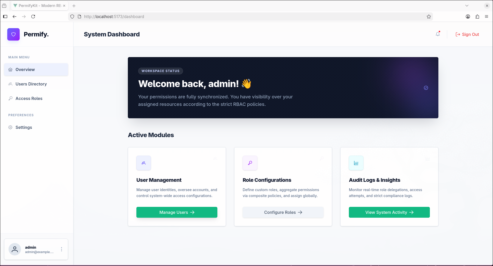

# PermifyKit - Modern RBAC Fullstack Starter Kit

PermifyKit is a production-ready, enterprise-grade Role-Based Access Control (RBAC) starter kit. It provides a solid foundation for building secure web applications with a focus on developer experience, clean architecture, and premium aesthetics.



## 🚀 Tech Stack

### Backend
- **Language:** Go 1.22+
- **Framework:** [Fiber v2](https://gofiber.io/) (Express-inspired, high performance)
- **ORM:** [GORM](https://gorm.io/)
- **Database:** PostgreSQL
- **Security:** JWT Authentication, Bcrypt password hashing
- **Architecture:** Clean Architecture (Entities, Repositories, UseCases, Handlers)

### Frontend
- **Framework:** [Vue 3](https://vuejs.org/) (Composition API)
- **Build Tool:** [Vite](https://vitejs.dev/)
- **State Management:** [Pinia](https://pinia.vuejs.org/)
- **UI Components:** [PrimeVue 4](https://primevue.org/)
- **Styling:** [Tailwind CSS v4](https://tailwindcss.com/)
- **Icons:** [PrimeIcons](https://primevue.org/icons/)

## ✨ Key Features

- **🔐 Robust Authentication:** Secure login flow with JWT stored in HTTP-only cookies or local storage.
- **🛡️ Granular RBAC:** Dynamic permission checking both on the backend (middleware) and frontend (directives/composables).
- **👥 User Management:** Full CRUD for system users, including role assignment.
- **🔑 Role Configuration:** Define custom roles and aggregate system-wide permissions.
- **📊 Modern Dashboard:** Sleek, responsive navigation with nested routing.
- **⚡ Performance Optimized:** Built for speed with Go and Vite.
- **🎨 Premium UI/UX:** Clean, professional aesthetic using Tailwind CSS v4 and PrimeVue.

## 🛠️ Getting Started

### Prerequisites
- [Go](https://golang.org/doc/install) (1.22 or later)
- [Node.js](https://nodejs.org/) (v18 or later)
- [PostgreSQL](https://www.postgresql.org/)
- [Docker](https://www.docker.com/) (Optional, for database)

### Installation

1. **Clone the repository:**
   ```bash
   git clone git@github.com:Basith-08/PermifyKit.git
   cd PermifyKit
   ```

2. **Backend Setup:**
   ```bash
   cd backend
   # Copy environment example
   cp .env.example .env
   # Install dependencies
   go mod tidy
   # Run the server
   go run cmd/api/main.go
   ```

3. **Frontend Setup:**
   ```bash
   cd frontend
   # Install dependencies
   npm install
   # Run development server
   npm run dev
   ```

## 🏗️ Project Structure

```text
.
├── backend
│   ├── cmd/api             # Application entry point
│   ├── internal
│   │   ├── domain         # Business entities
│   │   ├── repository     # Data access layer
│   │   ├── usecase        # Business logic layer
│   │   ├── delivery/http  # API Handlers
│   │   ├── middleware     # Security & Auth middlewares
│   │   └── config         # Configuration management
├── frontend
│   ├── src
│   │   ├── core           # Base API, router, and permissions
│   │   ├── modules        # Feature-based modular structure
│   │   │   ├── auth       # Authentication logic
│   │   │   ├── dashboard  # Main dashboard views
│   │   │   ├── users      # User management module
│   │   │   └── roles      # Role & permission module
│   │   └── assets         # Global styles and images
└── database               # SQL migrations and init scripts
```

## 📜 License

Distributed under the MIT License. See `LICENSE` for more information.

---